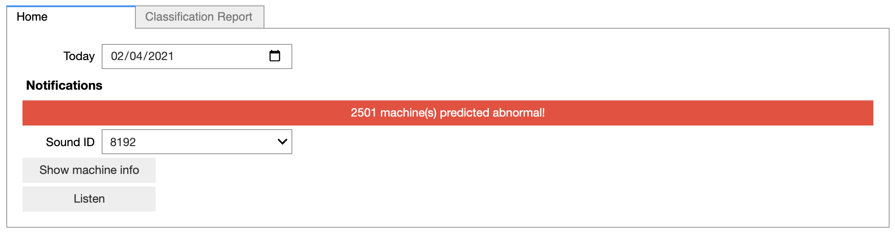
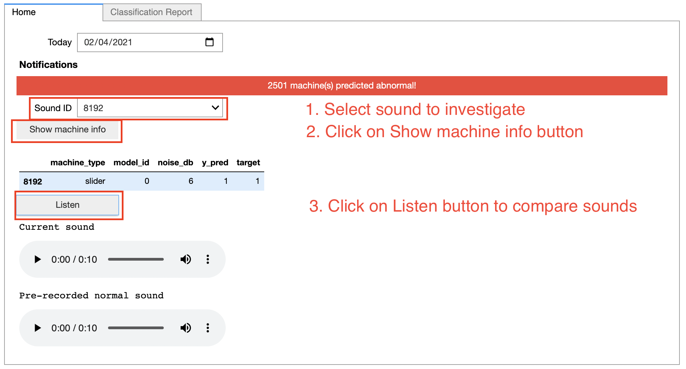

# sound-anomaly-detection
This is a work in progress.


## Table of Contents

- [Introduction](#introduction)

- [Installation](#installation)

- [Data sources](#data-sources)

- [Instructions](#instructions)

- [Architecture](#architecture)

- [Next steps](#next-steps)

---

## Introduction
### Description
This is a python project for *Codit Belgium*.
Their client is *Acme Corporation*, a worldwide supplier of technological equipment. The factory is facing significant problems with their manufacturing line, the machines are constantly facing failures due to a lack of maintenance and the production is stopped every time an unexpected failure is presented. As a result, Acme is losing millions of U.S Dollars and important clients like Wile E. Coyote are experiencing delays in deliveries.

*Acme Corporation* would like to have a machine learning model to detect and identify any anomaly from the sounds of their equipments. This model would allow them to operate the manufacturing equipment at full capacity and detect signs of failure before the damage is so critical that the production line has to be stopped.

The python program performs the following actions:
1. **Cleans** and **preprocesses the dataset** for machine learning models
2. **Trains** machine learning models
3. **Predicts** whether an industrial machine will fail and classifies the failures based on sound
4. **Evaluates** the model performance
5. **Export** data insights for dashboarding.

### Objectives
- Create a machine learning model to predict when a machine will fail based on sound
- Classify the failures based on sound in order to do more targeted maintenance.

### When?
It is a 2 weeks project.
The deadline to complete it is scheduled to `02/04/2021 at 9 a.m.`.

### Visuals



## Installation
To run the program and see a live demo of the code, you need:
- To install the libraries below
- To download the *MIMII* dataset (see [Data sources](#data-sources) for information).

### Install the libraries
| Library          | Used to                                        |
| ---------------- | :----------------------------------------------|
| Numpy            | To handle Numpy arrays                         |
| Pandas           | To store and access info in a DataFrame        |
| Matplotlib       | To plot the data                               |
| Scikit-learn     | To preprocess dataset, perform machine learning|
| imbalanced-learn | To deal with unbalanced data                   |
| xgboost          | To train model with gradient boosting algorithm|
| librosa          | To analyse audio                               |
| jupyter          | To see Exploratory Data Analysis and live demo |
| ipywidgets       | To create and display widgets                  |


Follow these instructions to install the required libraries: on terminal
1. Open your terminal;
2. cd to the directory where the `requirements.txt` file is located;
3. Create and activate your virtual environment.
4. Run the command: 
```pip3 install -r requirements.txt```

To see the live demo, you need to enable `widgetsnbextension`
1. Open your terminal;
2. Create and activate your virtual environment.
3. Run the command: 
```jupyter nbextension enable --py widgetsnbextension```

### Additional info
Note that we develop the source code on
- macOS Big Sur
- linux

## Data Sources
To train our machine learning model, we use the *MIMII* Dataset: sound dataset for ***M**alfunctioning **I**ndustrial **M**achine investigation and **I**nspection*.
The dataset comprises of sounds from four types of industrial machines:
- fans
- pumps
- slide rails
- valves

For each type of machine, the following sounds of seven individual product models were recorded (in the public dataset, only sounds from 4 models are currently available):
- normal sounds from 5000 seconds to 10000 seconds 
- anomalous sounds around 1000 seconds: e.g., contamination, leakage, rotating unbalance, and rail damage
- additionally, the background noise from several factories was combined with the machine sounds. 

"The sounds were recorded by eight-channel microphone array with 16 kHz sampling rate and 16 bit per sample" (*Purohit & al., 2019).

You can download the public MIMII Dataset here: https://zenodo.org/record/3384388

Source:
Harsh Purohit, Ryo Tanabe, Kenji Ichige, Takashi Endo, Yuki Nikaido, Kaori Suefusa, and Yohei Kawaguchi, “MIMII Dataset: Sound Dataset for Malfunctioning Industrial Machine Investigation and Inspection,” arXiv preprint arXiv:1909.09347, 2019. URL: https://arxiv.org/abs/1909.09347"

## Instructions
### How to run the program
- Run `main.py` to start the program.
- Run `main_live_demo.ipynb` to see a live demo of the program.
Or
- On your terminal:
```python3 main.py```

### Usage example



## Architecture
The project is structured as follows:

```
sound-anomaly-detection
│   README.md               :explains the project
│   main.py                 :script to run in order to start the program
│   main_live_demo.ipynb    :jupyter notebook to see a live demo of the program
│   requirements.txt        :packages to install to run the program
│   .gitignore              :specifies which files to ignore when pushing to the GitHub repository
│
└───core                    :directory contains all the core scripts of the program
│   │   __init__.py
│   │   pipeline_all_machines.ipynb :ML pipeline (outputs best model for all machines)
│   │
│   └───assets              :contains the sound datasets and images
│       ├───images
│       └───sounds
```

### Roadmap
- [x] Download the dataset
- [X] Build a dataset by extracting audio features and define target feature
- [X] Exploratory Data Analysis
- [X] Clean dataset
- [X] Prepare dataset for machine learning
- [X] Build machine learning models for predictive classification
- [X] Select the right performance metrics for your model
- [X] Evaluate the distribution of datapoints and evaluate its influence in the model
- [X] Tuning parameters of the model for better performance
- [X] Identify if we underfit or overfit
- [X] Select best model according to performance metrics and customer's requirements
- [X] Define the strengths and limitations of the model

Finally:
- [X] Draw conclusions from data analysis and predictions
- [X] Build dashboard to display data insights
- [ ] Optimize code
- [x] Prepare presentation (15 minutes + 5 minutes Q&A)


### Author(s) and acknowledgment
This project is carried out by:
- **Louan Mastrogiovanni**
- **Van Frausum Derrick** 
from Theano 2.27 promotion at BeCode.

We would like to thank:
- **Codit Belgium** for this opportuniy to work on a use-case
- Harsh Purohit, Ryo Tanabe, Kenji Ichige, Takashi Endo, Yuki Nikaido, Kaori Suefusa, and Yohei Kawaguchi for the *MIMII* Dataset
- and our colleagues and coaches at BeCode for their help and guidance.


## Next steps
- Progress in roadmap: Exploratory Data Analysis
